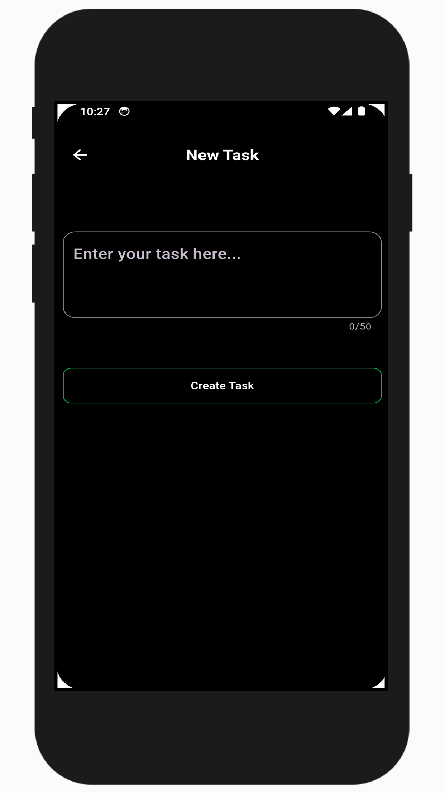
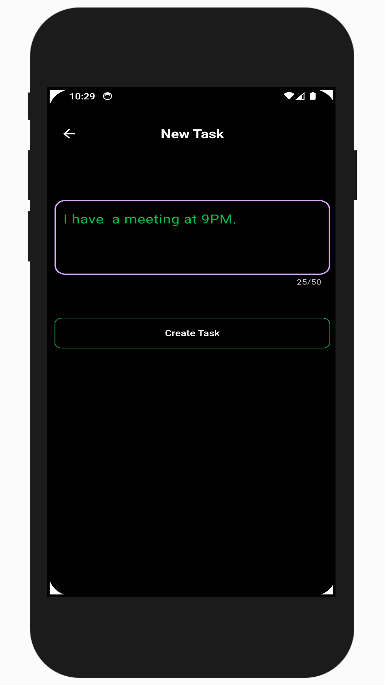
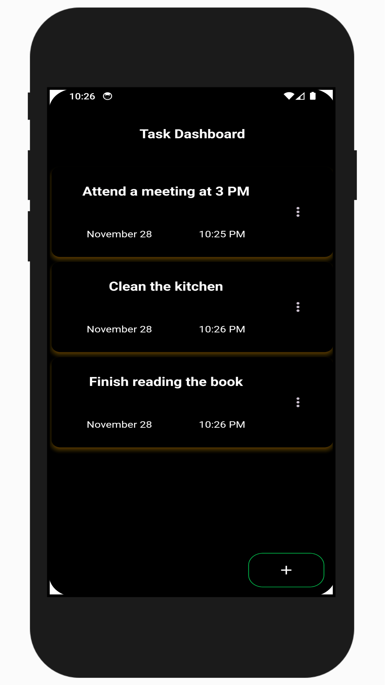
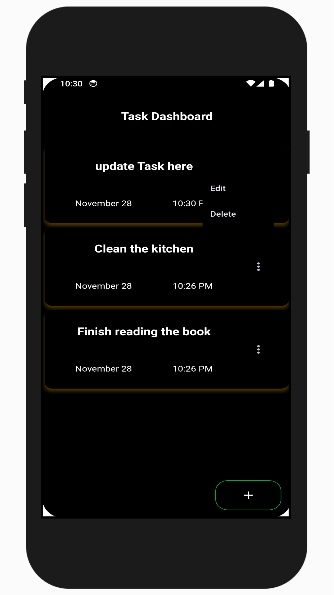
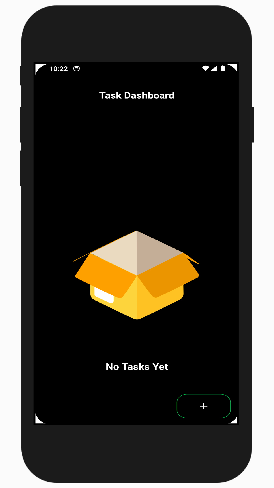
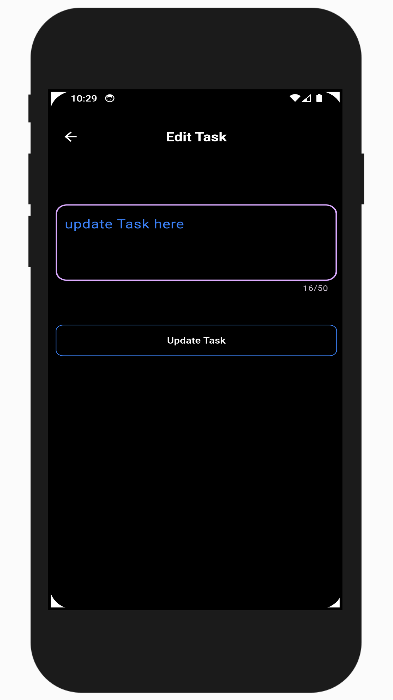

# 📝 Todo List App

**A Flutter-based Todo App** A Todo List App built with Flutter and Hive as the local database. This app allows users to create, edit, and delete tasks. The app also automatically sets the current date and time when a task is created based on the user's device settings. It's a simple, efficient tool for managing tasks and staying organized.


---

## 📋 Features

- **Task Management:**  
  Users can create, edit, and delete tasks with ease.

- **Automatic Date and Time:**  
  When a task is created, the app automatically sets the current date and time based on the user's device settings.

- **Local Storage with Hive:**  
  Tasks are stored locally using Hive for persistent data management.

Option to divide the total tip and bill amount among multiple people.

- **Task List Display:**  
  All tasks are displayed on the home screen with their corresponding date and time.

- **Responsive Design**  
  Optimized for both mobile and tablet screens.


---

## 🚀 Installation

1. **Clone the Repository:**
   ```bash
   git clone https://github.com/rabby220/Tip-Calculator.git
   cd Tip-Calculator

2. **Install Dependencies::**
   ```bash
   flutter pub get

3. **Install Dependencies::**
   ```bash
   flutter run

---

## 🛠️ Tech Stack

##### Flutter (Dart): <br>
- Cross-platform framework for building mobile apps.
##### State Management: <br>
- GetX for managing state and handling UI reactivity.
##### Local Storage: <br>
- Hive for local data storage and task management.


---

## 📸 Screenshots
assets/screenshot/add-task.png

<p align="center">
  
  
  
</p>

<p align="center">
  
  
  
</p>


---

## 💡 How It Works

1. Create Task: <br>
   Enter the task details and hit the Add Task button. The current date and time are automatically assigned to each task.

2. Edit Task: <br>
   To edit a task, click the task you want to modify, update the task details, and save.

3. Delete Task:<br>
   Swipe or click the delete button next to any task to remove it.

4. Task Display: <br>
   The task list is displayed on the home screen, showing task details along with the assigned date and time.


---


## 📝 Future Enhancements
- Add task priorities (e.g., High, Medium, Low).
- Implement task reminders and notifications.
- Support for task categorization or labels (e.g., Work, Personal).
- Synchronization across multiple devices using Firebase or cloud storage.


## 💡 How to Contribute

1. Fork the repository.
2. Create a new branch:
   ```bash
   git checkout -b feature-name

3. Commit your changes:
   ```bash
   git commit -m "Add some feature"

4. Push to the branch:
   ```bash
   git push origin feature-name

5. Open a Pull Request.

## 📫 Contact
If you have any questions or suggestions, feel free to reach out via [Email](mailto:fajlarabby220@gmail.com).